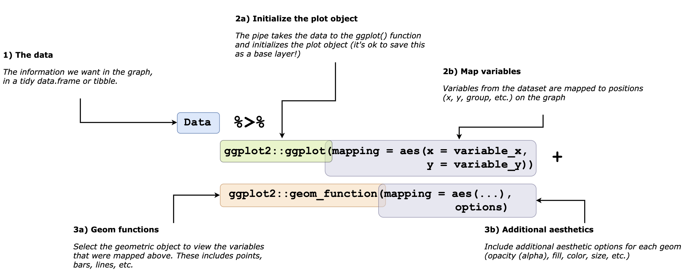

```{r setup, include=FALSE}
# output: github_document
library(tidyverse)
library(magrittr)
library(mosaic)
library(skimr)
# create image folder ----
if (!file.exists("figs/")) {
  dir.create("figs/")
}
# create data folder ----
if (!file.exists("data/")) {
  dir.create("data/")
}
# knitr settings ------
knitr::opts_chunk$set(
  echo = TRUE, # show all code
  tidy = FALSE, # cleaner code printing
  size = "small",
  fig.path = "figs/"
) # smaller code
knitr::opts_knit$set(
  width = 78
)
base::options(
  tibble.print_max = 25,
  tibble.width = 78
)
```

# Objectives

1. The grammar of graphics  
2. The `ggplot2` template    
3. Aesthetics, stats, geoms, and layers 


## Loading the packages 

First, load the `tidyverse` and other packages.

```{r packages, message=FALSE, warning=FALSE}
library(tidyverse)
library(ggrepel)
library(janitor)
library(xml2)
library(rvest)
```

The [`tidyverse`](http://tidyverse.org/) is a collection of R packages developed by RStudio's Chief Scientist [Hadley Wickham](http://hadley.nz/). These packages work well together as part of larger data analysis pipeline. To learn more about these tools and how they work together, read [R for data science](http://r4ds.had.co.nz/). 


## The grammar

[Wilhelm von Humboldt](https://en.wikipedia.org/wiki/Wilhelm_von_Humboldt) described language as a system for “*making infinite use of finite means.*” Grammar is then a set of rules used to generate comprehensible sentences in a language (human or computer languages). `ggplot2` has an expansive vocabulary, so knowing a finite list of functions and their syntax unlocks an unlimited number of visualizations.

Within the R language, `ggplot2` provides a rich vocabulary for graphical elements. Knowing how to use the grammar of `ggplot2`’s gives us an excellent mental model for thinking about data visualizations. 

## A template 

The template for creating a `ggplot2` graph is below. 

```{r 01-ggplot2-template, echo=FALSE}
knitr::include_graphics(path = "figs/01-ggplot2-template.png")
# 
```

## The data

We will be using the `fivethirtyeight` package, which is the raw data behind the story "*Dear Mona, Which State Has The Worst Drivers?*" https://fivethirtyeight.com/features/which-state-has-the-worst-drivers/

```{r fivethirtyeight-BadDrivers}
BadDrivers <- fivethirtyeight::bad_drivers
```


## Aesthetics 

The aesthetic is the part of the graph we see. When we apply a numerical value (or variable) to an aesthetic, we refer to this as **mapping**. Below are some examples of aesthetic mappings.

```{r aes-elements.png, echo=FALSE}
knitr::include_graphics(path = "figs/aes-elements.png")
# 
```

As we will see, each aesthetic will fit with a particular kind of variable, or relationship between variables. We'll start with visualizing a single variable, then move onto graphs with two and more variables. 

## Stats and geoms

Every geometric object has belongs to a particular statistical transformation, and every statistical transformation has a particular geometric object. We can get under the hood of these functions by looking at the `layer` function. The `num_drivers` is the "*Number of drivers involved in fatal collisions per billion miles.*" I think of this as, "*people dying in car crashes/1,000,000,000 miles*". So if a state has a lot of drivers, but they aren't driving many miles this number would be low. Let's create our first graph that looks at this single variable. 

```{r labs_num_drivers}
labs_num_drivers <- ggplot2::labs(
  title = "The distribution of num_drivers",
  subtitle = "Number of drivers involved in fatal collisions per billion miles",
  caption = "https://fivethirtyeight.com/",
  x = "people dying in car crashes/1,000,000,000 miles"
)
```

Now we can create this graph and add the labels. We would like to see the scatter plot between two numerical variables, `perc_speeding` and `insurance_premiums`. We will map `perc_speeding` to the `x` axis, and `insurance_premiums` to the `y` axis. 
We will assign this to a new object called `ggp_bdrivers`, and the `ggp_` prefix will remind us this is a `ggplot2` graph object.

```{r ggp_diamonds_aes}
# start with the canvas
ggp_num_drivers <- BadDrivers %>% 
    ggplot(mapping = aes(x = num_drivers))
ggp_num_drivers + labs_num_drivers
```

## Tip: Naming conventions

If you're programming in R, you'll be forced to start thinking about how to name all of the objects you're creating. They'll be data frames, lists, vectors, functions, urls, etc. floating around in your working environment, and you will want to know how to name these things. Having a minimal set of standards will help keep you organized and also make collaborating with you much easier. 

Here is an example of naming conventions I use for R objects:

+ `DataFrame` or `Tibbles` are `PascalCase` which is to capitalize the first word/last word/all words in-between  
+ `vectors` are `snake_case` with words separated by underscores `lower_case`   
+ `listObject`s are `camelCase`, means capitalizing all words, but the first word is lowercase  

The contents of the name is equally important. I will name labels with a `labs_` prefix, and the graphs with a `ggp_` prefix. This way, when I end up creating multiple graphs, I can use the tab-completion in RStudio to locate the correct graphs and labels. See the image below.

```{r 02-naming, echo=FALSE}
knitr::include_graphics(path = "figs/02-naming.gif")
```

This saves both keystrokes and neurons.

## Graph layers

Now that I have a canvas with a single variable, I will add the data onto the graph using the `ggplot2::layer()` function. This allows me to add the various aesthetics bit-by-bit. This process is helpful because it allows us to see the how `ggplot2` grammar works, and how different `geom`s are combined with specific statistics to create the desired plots.

```{r layer-bar}
ggp_num_drivers_02 <- ggp_num_drivers +
    ggplot2::layer(
        geom = "bar",
        stat = "bin", # this is the bin stat, because each observation will get
                      # 'binned' into the bars
        
        position = "identity", # now that the data have been changed into bins, 
                                # we can plot it 
    
            params = list( # <--- some parameters for the bars
                
                      binwidth = 0.5, # this is the size of the bin
                      fill = "white", # pick a color for the bars
                      color = "steelblue" # pick a color for the bar borders
                      
                      ) # <-- end of the parameters
                    ) # <-- end of the layer
ggp_num_drivers_02 + labs_num_drivers
```

With the `ggplot2::layer()` function, we can specify each portion of the graph layer: 

- The `geom` for a bar chart is a `"bar"`  
- The `stat` for this plot is `"identity"`, which means we will be leaving the data unchanged    
- `position` is also `"identity"`, because we are plotting the data as-is  

If we change the `geom` to a `"point"`, we have to add a `y` aesthetic. And also have to change the `stat` to `"identity"` so each observation gets plotted as-is.

Let's use the `state` variable for the `y` axis and the `num_drivers` for the `x`.

```{r labs_state_X_num_drivers}
labs_state_X_num_drivers <- ggplot2::labs(
  title = "Fatal collisions by state",
  subtitle = "Number of drivers involved in fatal collisions per billion miles",
  caption = "https://fivethirtyeight.com/",
  x = "People dying in car crashes/1,000,000,000 miles",
  y = "State"
)
```

Now that we have the labels, we can build our plot.

```{r ggp_num_drivers_state}
ggp_num_drivers_state <- BadDrivers %>% 
    ggplot2::ggplot(mapping = aes(x = num_drivers, y = state)) + 
    ggplot2::layer(
          mapping = NULL, # already specified
          data = NULL, # already specified
          geom = "point", # scatter plot
          stat = "identity", # tells ggplot not to alter the data in any way
          position = "identity" # this tells ggplot to plot the data unchanged
) + labs_state_X_num_drivers
ggp_num_drivers_state
```


Let's break down this `ggplot2::layer()` function again:

- The `geom` for scatter plots is the `"point"`  
- The `stat` for this plot is `"identity"`, which means we will be leaving the data unchanged    
- `position` is also `"identity"`, because we are plotting the data as-is  

Now, this would be a lot to have to constantly write out, so `ggplot2` bundles all these elements into a single function, `ggplot2::geom_point()` (see below).

```r
Data %>% 

    ggplot2::ggplot(mapping = aes(x = variable_01, y = variable_02) + 
    
    # ALL OF THIS --->  ggplot2::layer(
                            mapping = NULL, 
                            data = NULL, 
                            geom = "point", 
                            stat = "identity", 
                            position = "identity") + 
    
    # BECOMES THIS --->  ggplot2::geom_point() + 
    
            labels # our predetermined labels
```

We can see that the `geom_` functions take all the specific elements for each kind of plot (bar charts, scatter plots, line graphs, etc.). Let's review the template again.

```{r 01-ggplot2-template-02, echo=FALSE}
knitr::include_graphics(path = "figs/01-ggplot2-template.png")
# 
```

As you can see from the template, **3a** and **3b** can be added to any object built with the `ggplot2::ggplot(aes( ))` function. We can add other graph elements too (facets, labels, themes, etc.), but we will cover these in the next section.

## Position

The position of the data is arguably the most important communication tool for any graph. When I had to learn how to use paper maps for land navigation in the Army, the first lesson was, "*the most important part of reading any map is finding your position on it.* 

We should probably be thinking about the positioning of our data on the graph before considering the other aesthetic elements (color, size, fonts, etc.). Many times, the position will drive the other aesthetic choices. For example, the graph above doesn't use position well because we can't tell which state has the highest number of fatal collisions. But we can fix this by adjusting the way the `state` variable is interpreted by `ggplot2`.

The `forcats::fct_reorder()` function will change the order of the `state` variable according to variable on the `x` axis (`num_drivers`).

```{r ggp_state_X_num_drivers_point}
# name it something that makes sense
ggp_state_X_num_drivers_point <- BadDrivers %>% 
    ggplot2::ggplot(mapping = aes(x = num_drivers, 
                                  # reorder the num_drivers by state
                        y = forcats::fct_reorder(.f = state, 
                                                 .x = num_drivers))) + 
    # shorten this to geom_point()
    ggplot2::geom_point() 

    
    ggp_state_X_num_drivers_point +
    
    # add labels
    labs_state_X_num_drivers
```

By sorting the position of the points in a organized way, we provide a clearer picture of the relationship between these two variables. This is helpful when we are ordering numerical data by categorical or discrete variables. 

## Choosing the right geoms & aesthetics

Ok, now that we have some `ggplot2` basics down, we can start using `geom`s to add layers to build better graphs. We'll start by shifting gears and looking at the relationship between between `perc_alcohol` (the percentage of drivers involved in fatal collisions who were alcohol-impaired) and `insurance_premiums` (car insurance premiums ($)). 

First, we should be able to imagine there is an *actual relationship* between these two variables, and we're not just trying to make a pretty picture. There is a good reason to think that the more alcohol-impaired collisions, the higher the insurance premium. 

The `perc_alcohol` and `insurance_premiums` are both numeric variables, so we will use a scatter plot (`geom_point`) to view their relationship. We are expecting to see points for each `state` at the intersection of percent speeding and insurance premiums. 

```{r ggp_alch_premiums}
ggp_alch_premiums <- BadDrivers %>%
  ggplot2::ggplot(aes(
    x = perc_alcohol,
    y = insurance_premiums
  ))
ggp_alch_premiums
```

This creates a blank canvas (or Cartesian coordinate system) with the two mapped variables (`perc_alcohol` and `insurance_premiums`), but we don't see any data points. We can add these in the next layers. 

But first we should add the labels to make sure we remember the relationship we're trying to illustrate. 

```{r labs_alch_premiums}
# give this a useful name
labs_alch_premiums <- ggplot2::labs(
  title = "How much is alcohol affecting insurance costs?",
  x = "Percent alcohol-impaired fatal collisions",
  y = "Insurance premiums ($)",
  subtitle = "data from article 'Dear Mona, Which State Has The Worst Drivers?'",
  caption = "https://fivethirtyeight.com/"
)
# add these to the plot
ggp_alch_premiums + labs_alch_premiums
```

Here we've created a nice canvas for our plot. 

```{r ggp_alch_premiums_point}
ggp_alch_premiums_point <- ggp_alch_premiums + 
    ggplot2::geom_point() + 
    labs_alch_premiums
ggp_alch_premiums_point
```

This plot looks like what we expected. Each point represents a state, and the axis are labeled correctly. But it would be nice to know which point represents each `state`. How can we add this variable to the graph.

First we build the new labels for the new graph.

```{r ggp_alch_premiums_point_02}
ggp_alch_premiums_point_02 <- ggplot2::labs(
  title = "How much is alcohol costing your insurance company?",
  x = "Percent alcohol-impaired fatal collisions by location",
  y = "Insurance premiums ($)",
  subtitle = "data from 'Dear Mona, Which State Has The Worst Drivers?'",
  caption = "https://fivethirtyeight.com/"
)
```

Next, we're going to build a graph that adds the `state` level information (hence the `by location` portion of the labels), so we should think about what aesthetic we should map `state` to.   

How about `color`? We can see if using a different `color` for each `state` helps explain the relationship between the percentage of drivers in alcohol-impaired collisions and the financial losses experience by insurance companies?

## Color 

We do this by mapping `color` to the `state` inside the `aes()` function.

```{r color}
ggp_alch_premiums_state_point <- BadDrivers %>%
  ggplot2::ggplot(aes(
    x = perc_alcohol,
    y = insurance_premiums
  )) + 
  ggplot2::geom_point(aes(color = state)) # use color here 
ggp_alch_premiums_state_point +
  ggp_alch_premiums_point_02
```

YIKES! Having a `color` for all 50 states makes legend makes the plot hard to see. 

### Geom layer options

We can drop the legend from the graph using `show.legend = FALSE` inside `ggplot2::geom_point()`. This is one of the `ggplot2::geom_point()` options. Others include `size` (the size of the points), `shape` (other shapes besides points), and `alpha` (the hue or opacity of the points). Read more about these by reading the help files in the `ggplot2::geom_point()` function. 

```r
??geom_point()
```

We will add this to the plot below and examine the results. 

```{r remove-legend}
ggp_alch_premiums_state_point <- BadDrivers %>%
  ggplot2::ggplot(aes(
    x = perc_alcohol,
    y = insurance_premiums
  )) + 
  ggplot2::geom_point(aes(color = state), 
                      show.legend = FALSE) 
ggp_alch_premiums_state_point +
  ggp_alch_premiums_point_02
```

That looks better. But we still can't tell what `state` each point represents. Maybe `color` isn't the best way to show the `state`-level data. What other options do we have? I usually revisit the data at this point to see what other wrangling options I have. 

For example, what if we categorized the states into `region`? That might make the information easier to digest.

## TIP: Adding new variables

Lets combine the `state`-level data into `region` using `Midwest`, `Northeast`, `South`, and `West`. Below are vectors for each US state `region`. 

```{r american_midwest}
american_midwest <- c(
  "Illinois", "Indiana", "Iowa", "Kansas", "Michigan",
  "Minnesota", "Missouri", "Nebraska", "North Dakota",
  "Ohio", "South Dakota", "Wisconsin"
)
american_northeast <- c(
  "Connecticut", "Maine", "Massachusetts",
  "New Hampshire", "Rhode Island", "Vermont",
  "New Jersey", "New York", "Pennsylvania"
)
american_south <- c(
  "Delaware", "Florida", "Georgia", "Maryland",
  "North Carolina", "South Carolina", "Virginia",
  "District of Columbia", "West Virginia", "Alabama",
  "Kentucky", "Mississippi", "Tennessee", "Arkansas",
  "Louisiana", "Oklahoma", "Texas"
)
american_west <- c(
  "Arizona", "Colorado", "Idaho", "Montana", "Nevada",
  "New Mexico", "Utah", "Wyoming", "Alaska", "California",
  "Hawaii", "Oregon", "Washington"
)
```

If I created a `region` variable, it would combine these states into four categories (instead of 50 individual states). Let's do this is one pipeline with `dplyr::mutate()`. 

```{r case_when_pipeline-ggp_bdrivers_point}
# wrangle the data
BadDrivers %>%
  dplyr::mutate(
    region =
      dplyr::case_when(
        state %in% american_midwest ~ "Midwest",
        state %in% american_northeast ~ "Northeast",
        state %in% american_south ~ "South",
        state %in% american_west ~ "West",
        TRUE ~ "Other"
      )
  ) %>% # now we plot the new region variable
  ggplot2::ggplot(aes(
    x = perc_alcohol,
    y = insurance_premiums
  )) +
  # add the points
  ggplot2::geom_point(aes(color = region)) +
    # add labels
  ggp_alch_premiums_point_02
```

This shows the `West` has states on the low end and high end of the percent alcohol-impaired fatal collisions, and the `West` is the only `region` without a state above `$1100` Insurance premiums. The `Midwest` also has the lowest insurance premiums (most are under $800).

Even with all this information, it would be nice to know what state each point represents on the graph. We know we shouldn't try to do this with a legend, but fortunately `ggplot2` has an entire ecosystem of supporting packages for plotting our data. We will explore a few in the next section. 

## Geoms from external packages

The great thing about `ggplot2` is the huge number of extensions and packages written specifically to work `ggplot2` graph objects (see the gallery [here](http://www.ggplot2-exts.org/gallery/)). To plot the `state`-level information on the graph, I will replace the `geom_point` with a `geom_label_repel()` from the [`ggrepel` package](https://cran.r-project.org/web/packages/ggrepel/vignettes/ggrepel.html#do-not-repel-labels-from-data-points), and apply the `label` and `color` to `state`.

```{r ggrepel}
BadDrivers <- BadDrivers %>%
  dplyr::mutate(
    region =
      dplyr::case_when(
        state %in% american_midwest ~ "Midwest",
        state %in% american_northeast ~ "Northeast",
        state %in% american_south ~ "South",
        state %in% american_west ~ "West",
        TRUE ~ "Other"))
# now we can plot this with the new text lables
ggp_alch_premiums_state_point_txt <- BadDrivers %>% 
ggplot2::ggplot(aes(
    x = perc_alcohol,
    y = insurance_premiums
  )) +
  # add the points
  ggplot2::geom_point(aes(color = region)) +
  # add the text
  ggrepel::geom_text_repel(aes(
      label = state), # this will be the 'state' text
    show.legend = FALSE, # still no legend
    size = 2) + # size of the text
    ggp_alch_premiums_point_02
```

Well now I have the `state` and `region` level data on the graph, but this is a lot to keep track of visually. Four colors isn't too overwhelming, but it would be nice to minimize the clutter and make the text a little larger so it's easier to read. Another tool for plotting complex relationships is [faceting](https://en.wikipedia.org/wiki/Faceting#). 

Faceting splits the plots into subsets, which gives us an opportunity to see explore patterns more thoroughly. We'll start by facetting the `perc_alcohol` by `insurance_premiums` plot `region`, and using `state` as a `text` label. Recall that the data positions are still mapped to each `point`.

The syntax for `ggplot2::facet_wrap()` takes a little getting used to, because we will use the tilde (`~`) in the `facets =` argument to indicate we want the data split across four levels of `region`. 

```{r ggp_alch_premiums_state_point_txt_facetw}
ggp_alch_premiums_state_point_txt_facetw <- BadDrivers %>% 
ggplot2::ggplot(aes(
    x = perc_alcohol, # position on x
    y = insurance_premiums # position on y
  )) +
  # add the points
  ggplot2::geom_point(aes(color = region)) +
  # add the text
  ggrepel::geom_text_repel(aes(
      label = state), # this will be the 'state' text
    show.legend = FALSE, # still no legend
    size = 2) + # size of the text
      # facet wrap on the region
  ggplot2::facet_wrap(facets = ~region) 
ggp_alch_premiums_state_point_txt_facetw +
  # add the labels
  ggp_alch_premiums_point_02
```

## Tip: Scraping wikipedia data

This shows us the `Northeast` and `South` have the highest number for Insurance premiums (specifically DC, Louisiana, New Jersey and New York). The `Midwest` has the lowest Insurance premiums (with the exception of Michigan), despite having quite a few states with high numbers of alcohol-impared fatal collisions. Both the Midwest and the West have a lot of wide open spaces, and the Northeast and South have states with some of the highest population density. See the [data here](https://en.wikipedia.org/wiki/List_of_states_and_territories_of_the_United_States_by_population_density).

```{r scrape-wiki-data}
# wiki url ----------------------------------------------------------------
# read more here: https://xml2.r-lib.org/
wiki_url <- "https://en.wikipedia.org/wiki/List_of_states_and_territories_of_the_United_States_by_population_density"
wiki_page <- xml2::read_html(wiki_url)

# extract tables -----
# read more here: https://rvest.tidyverse.org/index.html
# this will extract the tables tagged in the css 
wiki_tables <- wiki_page %>% rvest::html_nodes(css = "table")
# store and explore!
# utils::str(wiki_tables)

# look for the column title for the table we want
relevantTables <- wiki_tables[base::grep(pattern = "State", 
                                          x = wiki_tables)]
# store and explore!
# utils::str(relevantTables)
# Subset the list into a data.frame
WikiPopDensRAW <- rvest::html_table(x = relevantTables[[1]], fill = TRUE)
# check structure 
WikiPopDensRAW %>% dplyr::glimpse(78)
```

We can see these first two rows were actually the column names, so we can do a quick wrangling trick to paste them to the existing names. 

```{r CleanColNames}
# store names
raw_wiki_names <- WikiPopDensRAW %>% 
  janitor::clean_names() %>% 
  names()
# get the names in row 2
WikiPopDensRAW %>% 
  row_to_names(row_number = 1) %>% 
  clean_names() %>% 
  names() -> raw_wiki_names_02
# put these in a tibble
WikiNames <- tibble(raw_wiki_names, raw_wiki_names_02)
WikiNames %>% 
  mutate(
    # remove numbers 
     raw_wiki_names = str_remove_all(raw_wiki_names, "[0-9]+"),
     # remove trailing underscores
     raw_wiki_names = str_remove_all(raw_wiki_names, "_$"),
     # lowercase
     raw_wiki_names = str_to_lower(raw_wiki_names)) %>% 
    # stick these together
  tidyr::unite(col = "new_colname", 
               sep = "_") -> CleanColNames
CleanColNames
```

Another option for wrangling is below:

```{r NewColnames}
# add a simple id to pivot on
WikiPopDensRAW[ 1, ] %>% tibble::add_column(x = 1) %>% 
  tidyr::pivot_longer(names_to = "name", values_to = "value", cols = -c(x)) %>% 
  # remove the id
  dplyr::select(-x) %>% dplyr::mutate(
      # remove numbers from name
    name = stringr::str_remove_all(string = name, pattern = "[0-9]+"),
      # remove punctuation from name
    name = stringr::str_remove_all(string = name, pattern = "[:punct:]"),
     # replace punctuation in value
    value = stringr::str_replace_all(string = value, pattern = "[:punct:]", 
                                                        replacement = " ")) %>% 
  # stick these together
  tidyr::unite(col = "new_colname", 
               sep = " ") %>% 
  dplyr::mutate(
    # lower case
    new_colname = stringr::str_to_lower(new_colname)) -> NewColnames
NewColnames
```

We now set these names to `WikiPopDensRAW` and change `state_etc_state_etc` to `state` and drop the first row of names. 

```{r set-names-WikiPopDens}
WikiPopDens <- WikiPopDensRAW %>%
  set_names(value = NewColnames[[1]]) %>%
  janitor::clean_names() %>% 
  dplyr::rename(state = state_etc_state_etc) %>% 
  dplyr::slice(-1)
utils::head(WikiPopDens, 10)
```

There are still come characters in here that will give us problems (i.e. `<1`, `,`), so we will clean those next.

### Use iteration to remove string patterns

Now we use the `purrr::map2_df()` function to remove the characters from the numeric values. 

```{r map2_df-str_remove_all}
WikiPopDens <- WikiPopDens %>%
  map2_df(.x = ., .f = str_remove_all, .y = "[:punct:]") %>% 
  map2_df(.x = ., .f = str_remove_all, .y = "<") %>% 
  # convert state to factor
  mutate(
    state = as.factor(state)) %>% 
  mutate(across(where(is.character), as.numeric)) 
WikiPopDens %>% glimpse()
```

Now we have a table with 50 states and their population density information that we can use to try and understand the relationship between insurance premiums and  alcohol-impaired fatal traffic collisions. Let's join these two tables together and see what we can find out. 

```{r join}
# convert state and region to factor
BadDrivers <- BadDrivers %>% 
  mutate(
    region = as.factor(region),
    state = as.factor(state))
# we want to join the tables on 51 rows (50 states + district of columbia)
BadDriversWiki <- dplyr::inner_join(x = BadDrivers, 
                  # start with original data
                  y = WikiPopDens, 
                  # add new columns
                  by = "state") # using this key 
BadDriversWiki %>% glimpse(78)
```

Before we plot data that comes off the internet, we should check it to make sure it adds up. We're interested in the population density, and we can check the `population_density_permi2` using `dplyr`s data manipulation functions. See the comments for more details.

```{r check-density_pop_mi2}
BadDriversWiki %>% 
    # these should be population_numbers/land_area_mi2
       dplyr::mutate(pop_dens_mi2_check = population_numbers/land_area_mi2, 
                   pop_dens_km2_check = population_numbers/land_area_km2*10) %>% 
       dplyr::select(state, population_density_permi2, pop_dens_mi2_check,
                     population_density_perkm2, pop_dens_km2_check) %>% 
  utils::head(10)
```

It's appears the `population_density_permi2`, but we should adjust the `population_density_perkm2` column and assign it to `BadDriversWiki`.

```{r population_density_perkm2}
BadDriversWiki <- BadDriversWiki %>% 
 dplyr::mutate(population_density_perkm2 = population_numbers/land_area_km2*10)
```

We want to use the `population_density_perkm2` variable to help explain some of what we're seeing with the alcohol-impaired fatal collisions and insurance premiums. We'll use the `size` option in the `ggplot2::geom_point()` to include each state's population density on the graph. 

We'll create some more specific labels 

```{r labs_alch_premiums_point_pop_03}
labs_alch_premiums_point_pop_03 <- ggplot2::labs(
  title = "How much is alcohol costing your insurance company?",
  x = "Percent alcohol-impaired fatal collisions by location",
  y = "Insurance premiums ($)",
  subtitle = "Dot size = population density (Population/km^2)",
  caption = "https://fivethirtyeight.com/features/which-state-has-the-worst-drivers/"
)
```

Now we can build up our plot by assigning the new variable to the `size` aesthetic and adjusting the point opacity with `alpha` (this decimals or fractions). See the comments for more details.

```{r point-size}
BadDriversWiki %>% 
ggplot2::ggplot(aes(
    x = perc_alcohol, # position on x
    y = insurance_premiums # position on y
  )) +
  # add the points
  ggplot2::geom_point(aes(color = region,
                          # add population density here
                          size = population_density_perkm2),
                      # also adjust the opacity
                      alpha = 3/5,
                      # no legend
                      show.legend = FALSE) +
  # add the text
  ggrepel::geom_text_repel(aes(
      label = state), # this will be the 'state' text
    show.legend = FALSE, # still no legend
    size = 2) + # size of the text
  # facet wrap on the region
  ggplot2::facet_wrap(. ~ region) +
  # add the labels
  labs_alch_premiums_point_pop_03
```

This is looking better, but we want to remove any unnecessary elements that take away from the data display. 

## Use custom themes

The `ggplot2::theme_minimal()` function removes a lot of the extra graph elements to give a cleaner look.

```{r size-point}
ggp_alch_premiums_state_point_txt_facetw_pop <- BadDriversWiki %>% 
ggplot2::ggplot(aes(
    x = perc_alcohol, # position on x
    y = insurance_premiums # position on y 
  )) +
  # add the points
  ggplot2::geom_point(aes(color = region,
                          size = population_density_perkm2), # 
                      alpha = 3/5,
                      show.legend = FALSE) +
  # add the text
  ggrepel::geom_text_repel(aes(
      label = state), # this will be the 'state' text
    show.legend = FALSE, # still no legend
    size = 2) + # size of the text
      # facet wrap on the region
  # ggplot2::facet_wrap(facets = ~region) 
  # facet wrap on the region
  ggplot2::facet_wrap(. ~ region) +
  # add a theme for loosing some of the chart junk
  ggplot2::theme_minimal() +
  # remove the legend
  ggplot2::theme(legend.position = "none") +
    # add the new labs
    labs_alch_premiums_point_pop_03
# print
ggp_alch_premiums_state_point_txt_facetw_pop
```

We can also use themes from other packages. Below is an example from the `hrbrthemes` package. 

```{r theme_set-theme_ipsum_ps}
ggplot2::theme_set(hrbrthemes::theme_ipsum_ps(
  base_size = 8,
  strip_text_size = 9,
  axis_title_size = 10,
  plot_title_size = 14,
  subtitle_size = 10,
  base_family = "AndaleMono",
  strip_text_family = "TitilliumWeb-Regular",
  axis_title_family = "TitilliumWeb-Regular",
  subtitle_family = "TitilliumWeb-Regular",
  plot_title_family = "JosefinSans-Regular"
))
```

```{r use-theme}
BadDriversWiki %>% 
ggplot2::ggplot(aes(
    x = perc_alcohol, # position on x
    y = insurance_premiums # position on y
  )) +
  # add the points
  ggplot2::geom_point(aes(color = region,
                          # add population density here
                          size = population_density_perkm2),
                      # also adjust the opacity
                      alpha = 3/5,
                      # no legend
                      show.legend = FALSE) +
  # add the text
  ggrepel::geom_text_repel(aes(
      label = state), # this will be the 'state' text
    show.legend = FALSE, # still no legend
    size = 2) + # size of the text
  # facet wrap on the region
  ggplot2::facet_wrap(. ~ region) +
  # add the labels
  labs_alch_premiums_point_pop_03
```

Now we have a graph that combines the `position`s, `color`s, `size`, `lab`els, and `facet`s to display the relationship between insurance premiums, the percent of alcohol-impaired fatal collisions, and population density by region and state. 

### What can we say about the relationships? 

We can see DC has the highest population density, and also has a high premium. New Jersey and New York also have high premiums, but moderate levels of alcohol-impaired fatal collisions. The state with the highest level of alcohol-impaired fatal collisions (Montana), also has a very low density and a low insurance premium.

## The end

This was a very brief tutorial of the `ggplot2` package, so I recommend learning more about the package by typing `library(help = "ggplot2")` into your R console, checking out the [ggplot2](http://ggplot2.tidyverse.org/reference/ggplot2-package.html) tidyverse page, or purchasing the [ggplot2 book](https://www.amazon.com/ggplot2-Elegant-Graphics-Data-Analysis/dp/331924275X/ref=sr_1_1?s=books&ie=UTF8&qid=1504615645&sr=1-1&keywords=ggplot2). 

```{r create-index.html, eval=FALSE, results='hide'}
rmarkdown::render(input = "README.Rmd", output_file = "docs/index.html")
```


